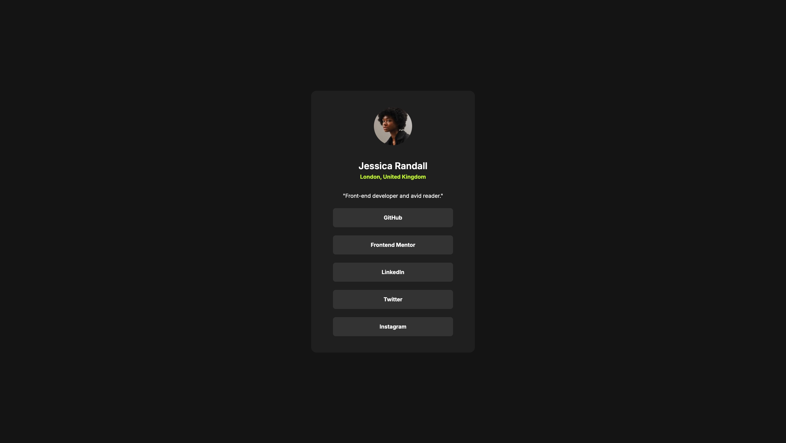

# Frontend Mentor - Social links profile solution

This is a solution to the [Social links profile challenge on Frontend Mentor](https://www.frontendmentor.io/challenges/social-links-profile-UG32l9m6dQ). Frontend Mentor challenges help you improve your coding skills by building realistic projects.

## Table of contents

- [Overview](#overview)
  - [Screenshot](#screenshot)
  - [Links](#links)
- [Author](#author)
- [Acknowledgments](#acknowledgments)

## Overview

A straightforward design challenge to create a social media card component, where we needed to implement hover effects on links to simulate a clickable interface, include a dedicated profile picture section, and maintain a refined monochromatic scheme using precisely three shades of gray.

### Screenshot

### Links

- Solution URL: [Add solution URL here](https://your-solution-url.com)
- Live Site URL: [Add live site URL here](https://your-live-site-url.com)

### Built with

- Semantic HTML5 markup
- SCSS custom properties
- Flexbox

## Author

- Website - [Gab-off](https://portfolio.gaboff.dev.br/)
- Frontend Mentor - [@Gab-off](https://www.frontendmentor.io/profile/Gab-off)
- Github - [@Gab-off](https://github.com/Gab-off)
